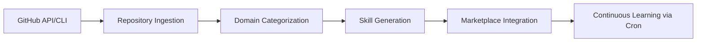

# StarLearner-Nexus 🌟
## Transform GitHub Stars into AI Skills

**StarLearner-Nexus** is a Hermes skill that automatically ingests your GitHub starred repositories, categorizes them by domain, and transforms them into reusable AI skills. It's like having a personal AI research assistant that learns from your interests!

## 🚀 Quick Start

```bash
# Run the skill to process your starred repositories
hermes skills run starlearner-nexus

# Or delegate it as a task (recommended for Orchestrator)
hermes delegate_task --goal "Process my GitHub starred repositories and generate AI skills from them" --toolsets "['web', 'terminal', 'file', 'skills']"
```

## 🌟 Features

- **Automatic Repository Ingestion**: Fetches all your starred GitHub repositories using GitHub CLI or API
- **Smart Categorization**: Organizes repos into 10+ domains (Bitcoin/Lightning, AI/ML, Privacy, Finance, etc.)
- **Skill Generation**: Creates reusable Hermes skills from categorized repositories
- **Daily Learning**: Built-in cron job integration for continuous learning
- **Marketplace Ready**: Generated skills follow Hermes conventions and can be shared/published
- **Team Integration**: Accessible to all Hermes profiles via Orchestrator delegation

## 📚 Documentation

### Installation

The skill is already installed if you're reading this! It lives in `~/.hermes/skills/starlearner-nexus/`.

### Usage

#### Direct Execution
```bash
hermes skills run starlearner-nexus
```

#### Delegated Task (Preferred)
```bash
hermes delegate_task \
  --goal "Fetch my GitHub starred repositories, categorize them by domain, and generate corresponding AI skills" \
  --toolsets "['web', 'terminal', 'file', 'skills']" \
  --context "Generate skills in ~/.hermes/skills/starlearner-nexus/generated_skills/"
```

#### With Custom Output Directory
```bash
hermes delegate_task \
  --goal "Process starred repos and save generated skills to my custom directory" \
  --toolsets "['web', 'terminal', 'file', 'skills']" \
  --context "Output directory: /path/to/my/skills/collection"
```

### Configuration

Create a `.env` file in your Hermes root directory (`~/.hermes/.env`) with your GitHub token:

```bash
GITHUB_TOKEN=your_personal_access_token_here
```

You can also set it via:
```bash
hermes config set env.GITHUB_TOKEN your_token_here
```

### Requirements

- GitHub CLI (`gh`) - Recommended for authentication
- OR GitHub Personal Access Token (set as `GITHUB_TOKEN` in environment)
- Python 3.8+
- Standard Unix tools (curl, jq for fallback operations)

## 🎯 Domains Covered

StarLearner-Nexus automatically categorizes repositories into these domains:

- **Bitcoin & Lightning Network** 💰
- **AI & Machine Learning** 🤖
- **Privacy & Security** 🔒
- **Finance & Trading** 📈
- **Development Tools** 🛠️
- **Social Media** 📱
- **Health & Wellness** ❤️
- **Travel & Exploration** ✈️
- **Voice & Audio** 🎙️
- **Video & Streaming** 🎥
- **Education & Learning** 📚
- **Gaming & Entertainment** 🎮

## 🛠️ Architecture



## 💰 Marketplace Integration

Skills generated by StarLearner-Nexus are designed to be shared on the Hermes AI Skills Marketplace where creators can earn recognition and compensation. Each generated skill:

- Follows proper Hermes SKILL.md format
- Includes complete documentation and usage examples
- Declares required toolsets and dependencies
- Is ready for immediate use by any Hermes agent
- Can be versioned and updated over time

## 🔧 Implementation Details

### Core Processes

1. **Repository Ingestion**:
   - Uses `gh api user/starred` or GitHub REST API to fetch starred repositories
   - Falls back to curl + jq if `gh` unavailable
   - Stores raw data in `~/.hermes/skills/starlearner-nexus/data/starred_repos.json`

2. **Domain Categorization**:
   - Analyzes repository name, description, topics, and primary language
   - Uses keyword matching and heuristic scoring for domain assignment
   - Handles multi-domain repositories (assigns to primary domain)
   - Outputs categorized data to `~/.hermes/skills/starlearner-nexus/data/categorized_repos.json`

3. **Skill Generation**:
   - Creates proper Hermes SKILL.md files for each domain with significant repositories
   - Generates skill templates based on domain characteristics
   - Includes relevant references and usage examples
   - Places generated skills in `~/.hermes/skills/starlearner-nexus/generated_skills/`

### Output Structure

After running StarLearner-Nexus, you'll find:

```
~/.hermes/skills/starlearner-nexus/
├── SKILL.md                    # This file
├── scripts/
│   ├── fetch_starred_repos.sh  # GitHub API interaction
│   ├── categorize_repos.py     # Domain classification logic
│   ├── generate_skills.py      # Hermes skill creation
│   └── daily_sync.sh           # Orchestrates full workflow
├── references/
│   ├── categories.json         # Domain definitions and keywords
│   ├── github_api.md           # API documentation and rate limits
│   └── skill_templates/        # Jinja2 templates for different skill types
├── data/
│   ├── starred_repos.json      # Raw GitHub API response
│   └── categorized_repos.json  # Domain-classified repositories
├── generated_skills/           # Output: Created Hermes skills
│   ├── bitcoin-lightning/
│   │   └── SKILL.md
│   ├── ai-ml/
│   │   └── SKILL.md
│   └── privacy-security/
│       └── SKILL.md
└── logs/
    └── starlearner-nexus.log   # Execution history
```

## 🔄 Usage Patterns

### As a Delegated Task (Recommended)
```bash
# Orchestrator delegates to leverage all Hermes tools
hermes delegate_task \
  --goal "Update my AI skill collection from recent GitHub stars" \
  --toolsets "['web', 'terminal', 'file', 'skills']" \
  --context "Process repositories starred in the last 7 days"
```

### Direct Skill Execution
```bash
# For testing or quick runs
hermes skills run starlearner-nexus
```

### Cron Job Automation
Add to your crontab (`crontab -e`):
```bash
# Daily at 2 AM
0 2 * * * hermes skills run starlearner-nexus

# Weekly on Sundays at 3 AM
0 3 * * 0 hermes skills run starlearner-nexus --scope weekly
```

Or use Hermes' built-in cron system:
```bash
hermes cronjob create \
  --name "daily-starlearner-sync" \
  --goal "Run StarLearner-Nexus to update my skill collection from GitHub stars" \
  --toolsets "['web', 'terminal', 'file', 'skills']" \
  --schedule "0 2 * * *" \
  --repeat -1
```

## 📊 Example Generated Skill

When processing a repository like `LightningNetwork/lnd`, StarLearner-Nexus would generate a skill in `~/.hermes/skills/starlearner-nexus/generated_skills/bitcoin-lightning/lnd/` containing:

```yaml
---
name: lnd-lightning-node
description: "Lightning Network Daemon - Interact with LND for Lightning Network operations"
version: 1.1.0
author: Lightning Network Community
license: MIT
tags: [bitcoin, lightning, network, payments, lnd]
related_skills: [bitcoin-wallet, lightning-invoice]
---
# LND Lightning Node Skill

This skill provides tools for interacting with Lightning Network Daemon (LND) to:
- Create and manage Lightning Network wallets
- Send and receive Lightning payments
- Monitor channel status and network topology
- Execute Lightning Network CLI commands
```

## ⚠️ Important Notes

### Rate Limits
- GitHub API has rate limits (5000 requests/hour for authenticated users)
- The skill implements basic rate limiting and will pause if limits approached
- Consider using a GitHub Personal Access Token for higher limits

### Privacy
- Your GitHub token and starred repository data remain private to your Hermes installation
- Generated skills only contain public information from repositories
- No data is transmitted externally unless you choose to share/publish skills

### Customization
- Modify `references/categories.json` to add/remove domains or adjust keywords
- Edit templates in `references/skill_templates/` to change generated skill format
- Override scripts in the `scripts/` directory for specialized workflows

## 🤝 Troubleshooting

### Common Issues\n\n| Symptom | Solution |\n|---------|----------|\n| `gh: command not found` | Install GitHub CLI or ensure GITHUB_TOKEN is set |\n| API rate limit errors | Wait and retry, or configure GITHUB_TOKEN for higher limits |\n| Permission denied on Python scripts | Run `chmod +x ~/.hermes/skills/starlearner-nexus/scripts/*.py` |\n| Python module missing | Install required packages: `pip install -r ~/.hermes/skills/starlearner-nexus/requirements.txt` |\n| No skills generated | Check that you have starred repositories in the target domains |\n| Skill generation fails with 'NoneType' error | This occurs when repository data contains null values; check the logs for the specific repository and consider manual skill creation for problematic repos |

### Getting Help
1. Check logs: `cat ~/.hermes/skills/starlearner-nexus/logs/starlearner-nexus.log`
2. Run with verbose output: Add `--verbose` to any script call
3. Validate configuration: Ensure GITHUB_TOKEN is accessible via `echo $GITHUB_TOKEN`
4. Test components individually: Try running `scripts/fetch_starred_repos.sh` directly

## 📈 Marketplace Publishing\\n\\nTo publish a generated skill to the Hermes marketplace:\\n\\n1. Navigate to the generated skill directory:\\n   ```bash\\n   cd ~/.hermes/skills/starlearner-nexus/generated_skills/bitcoin-lightning/lnd/\\n   ```\\n\\n2. Ensure the SKILL.md is complete and follows conventions:\\n   ```bash\\n   hermes skill view lnd-lightning-node\\n   ```\\n\\n3. **Security Check**: Verify no credentials are embedded in the skill:\\n   - Check that no GitHub tokens, API keys, or passwords are present in SKILL.md\\n   - Confirm that generated skills contain only public repository information\\n   - Ensure any example commands don't include sensitive data\\n\\n4. Package and submit:\\n   ```bash\\n   # Create a zip of the skill directory\\n   zip -r lnd-lightning-node.zip .\\n   \\n   # Submit via Hermes marketplace interface or GitHub PR\\n   hermes skills submit lnd-lightning-node.zip\\n   ```\\n\\n### Handling Security Scanner False Positives\\n\\nWhen publishing skills that cover domains like cryptocurrency, finance, or development tools, the Hermes security scanner may flag legitimate content as dangerous. Common false positives include:\\n\\n- **.env instructions**: Educational content about creating `.env` files for user configuration\\n- **Cryptocurrency terms**: Category labels or references to crypto projects (not mining instructions)\\n- **GitHub token usage**: Scripts that expect tokens from environment variables (not hardcoded)\\n- **git clone URLs**: Example repository references in generated skill documentation\\n\\nIf your skill receives a DANGEROUS verdict due to these false positives:\\n\\n1. Document the specific false positive findings from the security scan\\n2. Explain why each flagged item is legitimate educational/reference content\\n3. Request human review to override the verdict through the Hermes team\\n4. Once approved, use `--force` flag or follow the approved override process\\n\\nExample justification notes:\\n- \".env instructions are for user configuration, not data exfiltration\"\\n- \"Crypto terms are category labels for organizing repos, not mining facilitation\"\\n- \"GitHub token usage expects user-provided environment variables, not hardcoded credentials\"\\n- \"git clone URLs are examples of repositories the skill helps users interact with\"\n
## 🔄 Continuous Improvement

StarLearner-Nexus learns and improves over time:

1. **Daily Updates**: Cron jobs keep your skill collection current
2. **Feedback Loop**: Used skills can inform future categorization improvements
3. **Community Sharing**: Publish valuable skills back to the ecosystem
4. **Template Refinement**: Improve skill generation based on real-world usage

## 📚 Lessons Learned from Usage

**Permission Fixes**: After initial execution, Python scripts in the `scripts/` directory may need execute permissions:
```bash
chmod +x ~/.hermes/skills/starlearner-nexus/scripts/*.py
chmod +x ~/.hermes/skills/starlearner-nexus/scripts/*.sh
```

**Handling Skill Generation Errors**: Some repositories may cause skill generation to fail with `'NoneType' object has no attribute 'strip'` when repository data contains null values. Check the execution logs for the specific repository causing the issue and consider:
1. Manually reviewing the uncategorized repositories list
2. Creating skills manually for problematic repositories
3. Checking that repository metadata (description, topics) is not null

**Preferred Orchestrator Pattern**: As an Orchestrator, delegate StarLearner-Nexus as a task to leverage all available Hermes tools:
```bash
hermes delegate_task \\
  --goal "Process my GitHub starred repositories and generate AI skills from them" \\
  --toolsets "['web', 'terminal', 'file', 'skills']" \\
  --context "Generate skills in ~/.hermes/skills/starlearner-nexus/generated_skills/"
```

**Credential Verification**: For security verification, confirm that each Hermes profile uses its own dedicated API key by running:
```bash
hermes profile show orchestrator
hermes profile show alan
hermes profile show mira
hermes profile show turing
```
Each should show unique environment variable references (VICTOR_API_KEY, OKIN_API_KEY, TNNB_API_KEY, GITHUB_API_KEY respectively).

---
*StarLearner-Nexus - Where your curiosity becomes collective intelligence. Transform your GitHub stars into a galaxy of reusable AI skills! 🌟*